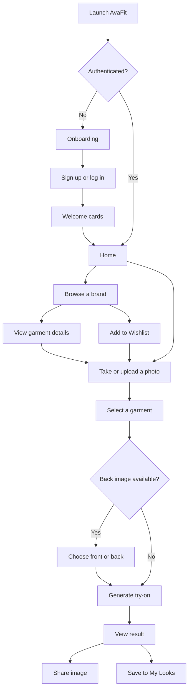
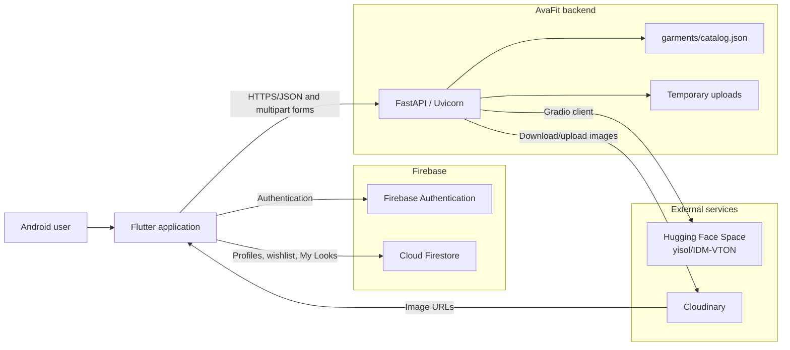
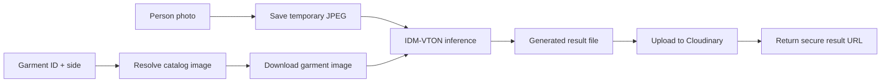
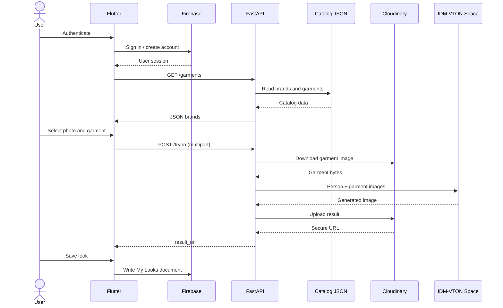

# AvaFit — AI Virtual Try-On

AvaFit is an Android-focused Flutter application that lets users explore clothing from multiple brands and visualize garments on their own photos using the IDM-VTON virtual try-on model.

The project combines a Flutter mobile client, Firebase Authentication and Cloud Firestore, a FastAPI orchestration backend, Cloudinary media storage, and the hosted `yisol/IDM-VTON` Hugging Face Space.

> [!NOTE]
> AvaFit is currently a prototype/academic project rather than a production-ready commerce platform. Some screens and workflows are placeholders; these are documented under [Known Limitations](#known-limitations).

## Table of Contents

- [Project Overview](#project-overview)
- [Problem Statement](#problem-statement)
- [Key Features](#key-features)
- [Screens and User Flow](#screens-and-user-flow)
- [Technology Stack](#technology-stack)
- [System Architecture](#system-architecture)
- [Frontend Architecture](#frontend-architecture)
- [Backend Architecture](#backend-architecture)
- [AI/ML Pipeline](#aiml-pipeline)
- [Virtual Try-On Workflow](#virtual-try-on-workflow)
- [API Communication Flow](#api-communication-flow)
- [API Reference](#api-reference)
- [Data and Storage](#data-and-storage)
- [Folder Structure](#folder-structure)
- [Installation](#installation)
- [Environment Variables](#environment-variables)
- [Local Development](#local-development)
- [Deployment Guide](#deployment-guide)
- [Dependencies](#dependencies)
- [Known Limitations](#known-limitations)
- [Future Improvements](#future-improvements)
- [Contributors](#contributors)
- [License](#license)

## Project Overview

AvaFit addresses the uncertainty of shopping for clothes online by allowing a user to:

1. Create or access an account.
2. Browse garments grouped by brand and category.
3. Capture or upload a personal photo.
4. Select a garment and, where available, its front or back view.
5. Generate an AI-composited try-on result.
6. Share the result or save it to a personal **My Looks** collection.

The application contains four brand catalogs—Breakout, Engine, Sapphire, and Khaadi—whose garment metadata is maintained by the backend. Garment media and generated images are hosted on Cloudinary.

## Problem Statement

Traditional online clothing catalogs show garments on models or isolated product images, making it difficult for customers to estimate how an item may look on their own body. This uncertainty can reduce purchase confidence and contribute to returns.

AvaFit explores an AI-assisted solution: combine a user-provided photograph with a selected garment image to produce a visual approximation before purchase. The generated image is intended as a styling preview, not a precise guarantee of fit, sizing, fabric behavior, or body measurements.

## Key Features

### Authentication and profiles

- Email/password registration and login with Firebase Authentication
- Google Sign-In through Firebase
- Persistent authentication state
- Firestore user profiles
- Editable name, phone number, age, gender, height, and weight
- Profile-photo capture/upload through the backend and Cloudinary
- Password change, logout, and Firebase Auth account deletion

### Catalog and discovery

- Brand-based browsing
- Backend-managed garment catalog
- Category filters within a brand
- Garment detail pages with zoomable images
- Multiple product views where the catalog provides them
- Garment preselection when entering the try-on flow from a catalog or wishlist

### Virtual try-on

- Camera or gallery image selection
- IDM-VTON inference through a hosted Hugging Face Space
- Front/back garment-side selection for garments with multiple views
- Animated processing state
- Network timeout handling and one retry
- Zoomable result preview
- Native result sharing

### Personal collections

- Firestore-backed wishlist
- Save generated results to **My Looks**
- Full-screen saved-look preview
- Share and remove saved looks

## Screens and User Flow

### Primary screens

| Area | Screens and purpose |
| --- | --- |
| Entry | App splash, onboarding, login, and sign-up |
| Onboarding | Welcome and ready cards shown after authentication |
| Main navigation | Home, Wishlist, Camera, My Looks, and Profile |
| Catalog | Brand catalog, category filter, and garment details |
| Try-on | Photo selection, garment selection, processing, and result |
| Account | Profile editing and application settings |
| Supporting UI | Search, password recovery, OTP, and recently viewed |

### User journey



Password recovery, OTP verification, search, and recently viewed currently contain placeholder or UI-only behavior. See [Known Limitations](#known-limitations).

## Technology Stack

| Layer | Technologies |
| --- | --- |
| Mobile client | Flutter, Dart, Material 3 |
| Supported app platform | Android |
| Networking | `http`, multipart form uploads |
| Authentication | Firebase Authentication, Google Sign-In |
| User data | Cloud Firestore |
| Media selection | `image_picker` |
| Media sharing | `share_plus`, `path_provider` |
| Backend | Python, FastAPI, Uvicorn |
| AI integration | IDM-VTON via `gradio-client` and Hugging Face Spaces |
| Media storage | Cloudinary |
| Backend deployment | Current client URL targets Render; a Procfile also supports Railway/Heroku-style deployment |
| Configuration | FlutterFire, dotenv, Firebase rules |

## System Architecture

The Flutter client communicates with two application service boundaries:

- Firebase is accessed directly for authentication and user-owned data.
- FastAPI is used for catalog access, profile-photo uploads, and AI try-on orchestration.



### Responsibility boundaries

| Component | Responsibility |
| --- | --- |
| Flutter | UI, navigation, input validation, image selection, API calls, and result presentation |
| Firebase Auth | Email/password and Google identity management |
| Cloud Firestore | Profiles, wishlists, and saved-look metadata |
| FastAPI | Catalog serving, input orchestration, AI calls, Cloudinary uploads, and temporary-file cleanup |
| Hugging Face Space | IDM-VTON inference |
| Cloudinary | Garment media, profile photos, and generated try-on results |

## Frontend Architecture

The frontend uses a lightweight, feature-oriented Flutter structure without an external state-management framework. Screen widgets maintain local state, while static service classes encapsulate Firebase and HTTP operations.

### Application boot

`lib/main.dart`:

1. Initializes Flutter bindings.
2. Prints the configured API endpoints for debugging.
3. Initializes Firebase using generated FlutterFire options.
4. Starts `AvaFitApp`.

`AvaFitApp` configures Material 3, the application theme, and named routes. The initial splash screen checks the current Firebase session and sends authenticated users to the main interface.

### Navigation

Named routes cover the splash, authentication, onboarding, main application, settings, and profile screens. Catalog, camera, try-on, result, and saved-look detail screens use `MaterialPageRoute` so selected garment/result data can be passed directly.

The main scaffold exposes five tabs:

1. **Home** — profile greeting, virtual try-on entry, and brand grid
2. **Wishlist** — persisted favorite garments
3. **Camera** — take or upload a person photo
4. **My Looks** — persisted try-on results
5. **Profile** — account and personal details

### Service layer

| Service | Purpose |
| --- | --- |
| `TryOnService` | Loads garments and submits multipart try-on requests |
| `CloudinaryService` | Sends profile images to the backend for Cloudinary upload |
| `FirestoreService` | Manages user profiles, wishlist entries, and saved looks |
| `AvatarService` | References an avatar endpoint that is not implemented by the current backend |

### Models and local data

- `UserModel` represents Firestore profile fields.
- `Brand` represents the locally displayed brand cards.
- `lib/data/brands.dart` connects brand IDs to bundled logo assets.
- Backend garment maps are consumed dynamically rather than through a dedicated Dart garment model.

## Backend Architecture

The backend is a single FastAPI application in `backend/app.py`.

### Main responsibilities

- Serve a health response
- Read and return the JSON garment catalog
- Return one brand by ID
- Accept person images and garment selections
- Resolve and download Cloudinary garment images
- Invoke IDM-VTON
- Upload generated results and profile photos to Cloudinary
- Clean temporary person and garment files

### Catalog

`backend/garments/catalog.json` is the source of truth for:

- Brand ID, name, and tagline
- Garment ID, name, category, and price
- Primary garment image URL
- Optional additional image URLs

When `side=back` is requested, the backend uses the second entry in a garment's `images` array when it exists. Otherwise, it safely falls back to `image_url`.

### Error handling

The API returns FastAPI `HTTPException` responses for:

- Missing or invalid catalogs
- Unknown brands or garments
- Missing garment images
- Invalid profile-photo types
- Download, model, or upload failures

Temporary files are cleaned after successful requests and in error paths where possible.

For backend-specific notes, see [`backend/README.md`](backend/README.md).

## AI/ML Pipeline

AvaFit does not store or execute IDM-VTON weights inside this repository. The backend submits inference jobs to the hosted `yisol/IDM-VTON` Hugging Face Space through its Gradio API.



### Current inference parameters

| Parameter | Current value |
| --- | --- |
| Hosted model | `yisol/IDM-VTON` |
| API operation | `/tryon` |
| Garment description | `clothing item` |
| Automatic mask | Enabled |
| Automatic crop | Disabled |
| Denoising steps | 30 |
| Seed | 42 |

These values are hard-coded in the backend. The model output is a visual approximation and can be affected by pose, lighting, occlusion, garment image quality, model availability, and inference load.

## Virtual Try-On Workflow

1. The user opens the Camera tab or starts from a selected catalog/wishlist garment.
2. The app captures a new image or reads one from the device gallery.
3. The app requests the current catalog from `GET /garments`.
4. The user selects a garment. A preselected garment is automatically highlighted when the flow started from the catalog.
5. If the garment has a second image, the app exposes front/back selection.
6. The app performs a warm-up request to `GET /garments`.
7. The app sends a multipart `POST /tryon` request containing:
   - `person_image`
   - `garment_id`
   - `side`
8. FastAPI saves the person image temporarily and resolves the requested garment view.
9. FastAPI downloads the remote garment image when necessary.
10. FastAPI sends both images to the IDM-VTON Space.
11. The generated image is read and uploaded to `avafit/results` on Cloudinary.
12. FastAPI deletes temporary files and returns the Cloudinary `result_url`.
13. Flutter displays the remote result.
14. The user can share the image or save its metadata to Firestore under **My Looks**.

The mobile request has a five-minute timeout and retries once after selected network or timeout failures. Actual inference commonly takes one to several minutes, especially after a hosted service cold start.

## API Communication Flow



The backend does not currently authenticate Flutter API requests or validate Firebase ID tokens. Firebase authentication protects Firebase operations but not the public FastAPI endpoints.

## API Reference

The configured production base URL is:

```text
https://avafit-ai-try-on.onrender.com
```

For local development, use:

```text
http://localhost:8000
```

### `GET /`

Health check.

Example response:

```json
{
  "status": "ok",
  "app": "AvaFit"
}
```

### `GET /garments`

Returns all brands and their garments.

```json
{
  "brands": [
    {
      "id": "breakout",
      "name": "Breakout",
      "tagline": "Modern Pakistani Menswear",
      "garments": []
    }
  ]
}
```

### `GET /brands/{brand_id}`

Returns one brand and its garments. Unknown IDs return HTTP `404`.

### `POST /tryon`

Multipart form fields:

| Field | Type | Required | Description |
| --- | --- | --- | --- |
| `person_image` | File | Yes | Person photo used as the model background |
| `garment_id` | String | Yes | Garment ID from the catalog |
| `side` | String | No | `front` by default; `back` uses the second garment image when available |

Example success response:

```json
{
  "status": "success",
  "result_url": "https://res.cloudinary.com/.../tryon_result.jpg"
}
```

### `POST /upload-profile-photo`

Multipart form fields:

| Field | Type | Required | Description |
| --- | --- | --- | --- |
| `photo` | File | Yes | Profile image; its MIME type must begin with `image/` |

The backend uploads a face-centered `400 × 400` Cloudinary transformation.

Example success response:

```json
{
  "status": "success",
  "photo_url": "https://res.cloudinary.com/.../profile.jpg"
}
```

FastAPI automatically exposes interactive documentation at `/docs` and `/redoc` when the service is running.

## Data and Storage

### Firestore layout

The Flutter implementation uses the following logical structure:

```text
users/{uid}
├── uid
├── email
├── name
├── phone
├── photoUrl
├── age
├── gender
├── height
├── weight
├── createdAt
├── updatedAt
├── wishlist/{garmentId}
└── myLooks/{lookId}
```

Wishlist entries contain a copy of garment metadata plus `addedAt`. Saved looks contain the result URL, garment/brand labels, garment image URL, and `savedAt`.

> [!WARNING]
> The committed `firestore.rules` permits access to `users/{userId}` documents but does not explicitly match the `wishlist` and `myLooks` subcollections. Firestore rules do not automatically cascade into subcollections, so production rules should add user-owned subcollection matches.

### Cloudinary folders

| Folder | Content |
| --- | --- |
| `avafit/results` | Generated try-on results |
| `avafit/profiles` | Profile photos |

Garment catalog images are also Cloudinary-hosted, using URLs stored in `catalog.json`.

### Firebase Storage

Firebase Storage is listed as a Flutter dependency and storage rules are included, but the current application routes profile and result media through Cloudinary. No active `FirebaseStorage` calls were detected in the Flutter source.

## Folder Structure

```text
Avafit-AI-Try-On/
├── android/                     # Android project and Gradle configuration
├── assets/
│   └── images/
│       ├── brands/              # Local brand artwork
│       ├── icons/               # Application icon
│       ├── logos/               # AvaFit and Google artwork
│       └── products/            # Static placeholder product images
├── backend/
│   ├── app.py                   # FastAPI application and AI orchestration
│   ├── README.md                # Backend-specific documentation
│   ├── requirements.txt         # Pinned backend dependencies
│   ├── Procfile                 # Uvicorn deployment command
│   ├── runtime.txt              # Python runtime declaration
│   └── garments/
│       ├── catalog.json         # Brand and garment source of truth
│       └── images/              # Optional local development images
├── lib/
│   ├── app/                     # Root MaterialApp
│   ├── config/                  # Backend URL and endpoint configuration
│   ├── data/                    # Local brand metadata
│   ├── models/                  # User and brand models
│   ├── routes/                  # Named route definitions
│   ├── screens/
│   │   ├── auth/                # Login, sign-up, and recovery UI
│   │   ├── brand/               # Catalog and garment details
│   │   ├── camera/              # Camera/gallery entry
│   │   ├── home/                # Main landing screen
│   │   ├── orders/              # My Looks and previews
│   │   ├── profile/             # Profile editing
│   │   ├── tryon/               # Selection, progress, and results
│   │   └── wishlist/            # Saved garments
│   ├── services/                # Firebase and HTTP integrations
│   ├── utils/                   # Theme constants and maintenance helpers
│   ├── firebase_options.dart    # Generated Android Firebase options
│   └── main.dart                # Flutter entry point
├── test/                        # Flutter tests
├── firebase.json                # FlutterFire and Firebase rules configuration
├── firestore.rules              # Firestore security rules
├── storage.rules                # Firebase Storage rules
├── pubspec.yaml                 # Flutter dependencies and assets
├── requirements.txt             # Root Python environment snapshot
└── README.md                    # Project-wide documentation
```

Generated build folders, Python virtual environments, temporary uploads, and local secret files are ignored by Git.

## Installation

### Prerequisites

- Flutter SDK compatible with Dart `^3.9.2`
- Android Studio or Android SDK command-line tools
- A configured Android emulator or physical Android device
- Python 3.11 for parity with `backend/runtime.txt`
- A Firebase project with:
  - Android application registration
  - Email/password authentication
  - Google Sign-In, if required
  - Cloud Firestore
- A Cloudinary account
- Internet access to Cloudinary, Firebase, and the hosted Hugging Face Space

### 1. Clone the repository

```bash
git clone https://github.com/hashhaam/Avafit-AI-Try-On.git
cd Avafit-AI-Try-On
```

### 2. Install Flutter dependencies

```bash
flutter pub get
```

### 3. Configure Firebase

The repository metadata identifies the Firebase project `avafit-mad-final-project`, but a new developer should use their own project and regenerate configuration:

```bash
dart pub global activate flutterfire_cli
flutterfire configure
```

Select Android and ensure these generated files exist:

```text
lib/firebase_options.dart
android/app/google-services.json
```

The repository `.gitignore` excludes these files for new commits, although local copies may already exist in an existing checkout.

In Firebase Console:

1. Enable **Email/Password** authentication.
2. Enable **Google** authentication if Google Sign-In is required.
3. Create a Cloud Firestore database.
4. Add the correct Android SHA fingerprints for Google Sign-In.
5. Review and deploy the Firestore rules before using wishlist or My Looks.

### 4. Configure the backend

```bash
cd backend
python3.11 -m venv venv
source venv/bin/activate
pip install -r requirements.txt
cp .env.example .env
```

Update `.env` with Cloudinary credentials:

```dotenv
CLOUDINARY_CLOUD_NAME=your_cloud_name
CLOUDINARY_API_KEY=your_api_key
CLOUDINARY_API_SECRET=your_api_secret
PORT=8000
```

### 5. Configure the Flutter API URL

Edit `lib/config/api_config.dart`.

For an Android emulator:

```dart
static const String baseUrl = 'http://10.0.2.2:8000';
```

For a physical Android device, use the computer's LAN address:

```dart
static const String baseUrl = 'http://192.168.x.x:8000';
```

Both devices must be on the same network, and the host firewall must permit the connection.

For production, set the deployed HTTPS backend URL. The current code uses:

```dart
static const String baseUrl = 'https://avafit-ai-try-on.onrender.com';
```

## Environment Variables

### Backend

| Variable | Required | Purpose |
| --- | --- | --- |
| `CLOUDINARY_CLOUD_NAME` | Yes | Cloudinary account/cloud identifier |
| `CLOUDINARY_API_KEY` | Yes | Cloudinary API key |
| `CLOUDINARY_API_SECRET` | Yes | Cloudinary API secret |
| `PORT` | Deployment-dependent | Server port; most platforms inject this automatically |

No Hugging Face token is read by the current backend. The code accesses the public Gradio Space directly.

### Flutter

The Flutter application does not currently load runtime variables from a `.env` file. Its backend URL is a compile-time constant in `lib/config/api_config.dart`, while Firebase settings come from FlutterFire-generated files.

For production, consider `--dart-define`, flavors, or a dedicated environment configuration package instead of editing source constants.

### Secret handling

Never commit:

- `backend/.env`
- Cloudinary secrets
- Service-account credentials
- Private recovery codes
- Signing keys

The tracked file `assets/images/logos/github-recovery-codes.txt` appears potentially sensitive. Confirm whether it contains active credentials; if it does, revoke/rotate them and remove the file from Git history.

## Local Development

### Start the backend

From `backend/` with its virtual environment active:

```bash
uvicorn app:app --host 0.0.0.0 --port 8000 --reload
```

Alternatively:

```bash
python app.py
```

Verify the service:

```bash
curl http://localhost:8000/
curl http://localhost:8000/garments
```

API documentation is available at:

```text
http://localhost:8000/docs
```

### Run the Flutter application

From the repository root:

```bash
flutter pub get
flutter run
```

List available targets if necessary:

```bash
flutter devices
```

### Static checks

```bash
flutter analyze
flutter test
```

At the time this README was prepared, Dart analysis reported warnings and style/deprecation notices but no compile-time errors. The existing widget test is still Flutter's default counter test and does not represent the current AvaFit interface, so the test suite requires updating.

### Add or update garments

Edit `backend/garments/catalog.json`. Each garment requires at least:

```json
{
  "id": "brand_category_001",
  "name": "Garment Name",
  "category": "Shirts",
  "price": "PKR 2,490",
  "image_url": "https://example.com/front.jpg"
}
```

For front/back support:

```json
{
  "id": "brand_hoodie_001",
  "name": "Example Hoodie",
  "category": "Hoodies",
  "price": "PKR 4,990",
  "image_url": "https://example.com/front.jpg",
  "images": [
    "https://example.com/front.jpg",
    "https://example.com/back.jpg"
  ]
}
```

Keep garment IDs unique across all brands. High-resolution, centered garments on plain or transparent backgrounds generally provide better model inputs.

## Deployment Guide

### Backend deployment

The included `backend/Procfile` runs:

```text
web: uvicorn app:app --host 0.0.0.0 --port $PORT
```

The current Flutter client targets a Render URL, while the existing backend documentation describes Railway. Both platforms can run the Uvicorn process, but the repository does not contain a platform-specific Render blueprint, Railway configuration file, or Dockerfile.

#### Render

1. Create a new Python web service from the GitHub repository.
2. Set the root directory to `backend`.
3. Use:

   ```text
   pip install -r requirements.txt
   ```

   as the build command.
4. Use:

   ```text
   uvicorn app:app --host 0.0.0.0 --port $PORT
   ```

   as the start command.
5. Add all Cloudinary environment variables.
6. Deploy and verify `/`, `/garments`, and `/docs`.
7. Update `ApiConfig.baseUrl` to the deployed HTTPS URL.

#### Railway

1. Create a Railway project from the GitHub repository.
2. Configure the service root as `backend` if Railway does not detect it.
3. Add all Cloudinary environment variables.
4. Deploy using the included Procfile.
5. Verify the generated public domain and update the Flutter base URL.

Hosted free tiers may sleep after inactivity. This is why the Flutter service performs a catalog warm-up request before try-on.

### Firebase deployment

After reviewing the rules:

```bash
firebase login
firebase use your-project-id
firebase deploy --only firestore:rules,storage
```

Add explicit user-owned rules for the Firestore subcollections before relying on wishlist or My Looks in a deployed environment.

### Android build

Development APK:

```bash
flutter build apk --debug
```

Release APK:

```bash
flutter build apk --release
```

Release App Bundle:

```bash
flutter build appbundle --release
```

Before a production release:

- Replace `com.example.avafit` with a unique application ID.
- Configure a release signing key.
- Stop using the debug signing configuration.
- Regenerate Firebase configuration for the final application ID.
- Restrict backend CORS and protect API endpoints.
- Configure camera/media permissions for all target Android versions.

### Other Flutter platforms

iOS, web, macOS, Windows, and Linux project directories and Firebase options are not configured in this repository. Additional platform scaffolding and FlutterFire configuration would be required.

## Dependencies

### Main Flutter packages

| Package | Purpose |
| --- | --- |
| `firebase_core` | Firebase initialization |
| `firebase_auth` | User authentication |
| `cloud_firestore` | Profiles, wishlist, and saved looks |
| `firebase_storage` | Declared but not actively used by current app logic |
| `google_sign_in` | Google identity flow |
| `image_picker` | Camera and gallery selection |
| `http` | REST and multipart communication |
| `http_parser` | Multipart media types |
| `path_provider` | Temporary files for sharing |
| `share_plus` | Native result sharing |
| `webview_flutter` | Available supporting web view; not part of the main current flow |

See `pubspec.yaml` and `pubspec.lock` for exact versions.

### Backend packages

| Package | Purpose |
| --- | --- |
| `fastapi` | API framework |
| `uvicorn` | ASGI server |
| `python-dotenv` | Local environment loading |
| `gradio-client` | Hugging Face Space integration |
| `cloudinary` | Media upload and delivery |
| `python-multipart` | Multipart form parsing |
| `httpx` | Asynchronous garment image downloads |

Use `backend/requirements.txt` for backend installation. The root `requirements.txt` is a larger environment snapshot with different package versions and is not the deployment file used by the backend instructions.

## Known Limitations

### Product and user experience

- Password recovery, OTP, resend, and new-password screens are currently UI-only and do not reset Firebase credentials.
- Search does not query the backend and uses static suggestions/placeholders.
- Recently viewed uses bundled sample products and is not connected to user activity.
- `About AvaFit`, feedback, country, and terms settings have no implemented action.
- Body details are stored for future personalization but are not used by the current AI call or size recommendations.
- No purchasing, checkout, inventory, sizing, or retailer deep-link workflow is implemented.
- Post-login welcome cards may be shown after every successful login rather than only on first use.

### AI and backend

- Try-on inference depends on the availability and API compatibility of a third-party public Hugging Face Space.
- The model runs remotely, so person photos leave the AvaFit backend and are processed by an external service.
- Results are approximations and may contain pose, body, garment, texture, or boundary artifacts.
- A fixed seed and generic garment description are used for every request.
- There is no background queue, job status endpoint, cancellation, or durable retry mechanism.
- The backend creates a new Gradio client for each try-on request.
- The API has no Firebase token verification, rate limiting, quotas, request-size limits, or malware/content validation.
- CORS currently permits all origins.
- The person upload is stored using a `.jpg` suffix without validating or converting its actual file format.
- Only one catalog garment currently provides a dedicated back image.
- `/generate-avatar` is referenced by the unused Flutter `AvatarService`, but it is not implemented by FastAPI.

### Data and lifecycle

- Firestore rules do not explicitly permit the wishlist and My Looks subcollections.
- Deleting an account calls Firebase Auth deletion but does not explicitly remove the corresponding Firestore document/subcollections.
- Removing a profile photo clears its URL but does not delete the Cloudinary asset.
- Deleting a saved look removes Firestore metadata but not the generated Cloudinary image.
- There is no administrative catalog interface or database-backed product inventory.

### Platforms, quality, and deployment

- Only Android and Android Firebase options are configured.
- The Android package still uses the example ID `com.example.avafit`.
- Release builds use the debug signing configuration.
- The backend README references Railway while the current mobile URL points to Render.
- No CI/CD workflow, Dockerfile, health-monitoring configuration, or automated deployment manifest is included.
- Automated tests do not cover current application behavior.
- The codebase contains analyzer warnings, deprecated Flutter API usage, and production `print` statements.
- `backend/requirements.txt` and the root `requirements.txt` pin different versions.
- No repository-wide license file is present.
- Some image files have extensions that do not match their actual encoded formats.

## Future Improvements

- Implement Firebase password reset and verified OTP flows.
- Verify Firebase ID tokens in FastAPI and enforce authenticated API access.
- Add API rate limiting, file-size/type validation, structured logging, and restrictive CORS.
- Move long-running try-on work to a queue with job IDs, progress polling, cancellation, and retries.
- Pin or self-host the IDM-VTON runtime for predictable availability and versioning.
- Add privacy controls, consent messaging, retention policies, and media deletion endpoints.
- Update Firestore rules for user-owned wishlist and My Looks subcollections.
- Cascade account deletion across Firestore and Cloudinary.
- Add real search, recently viewed history, garment recommendations, and retailer links.
- Use profile/body data for size guidance only after appropriate validation and privacy review.
- Move environment URLs to Flutter flavors or `--dart-define`.
- Add typed garment/brand models and a state-management layer.
- Add unit, widget, integration, API, and end-to-end tests.
- Add CI for formatting, analysis, tests, backend linting, and deployment checks.
- Configure production Android identity, signing, permissions, and store metadata.
- Add iOS and web support where required.
- Reconcile deployment documentation and Python dependency files.
- Add a repository license after the maintainers confirm the intended terms.

## Contributors

Repository history currently identifies:

- [hashhaam](https://github.com/hashhaam) — project author and primary contributor

Additional contributors can be added here with their roles and profile links.

## License

The backend README states that the backend is MIT licensed, but no root `LICENSE` file is currently present. Until a license file is added by the project owner, the licensing terms for the complete repository cannot be confirmed confidently.

---

For implementation details limited to the API service, refer to [`backend/README.md`](backend/README.md).
